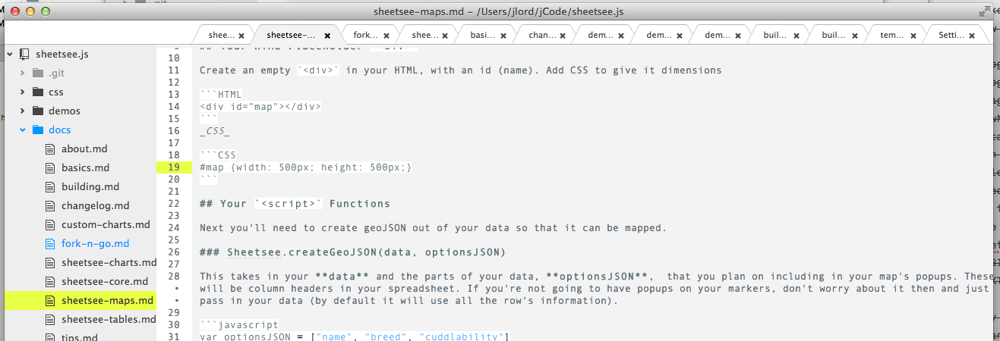

# Atom (Neon) Party Theme

A light (and bright) UI Theme for Atom. It looks :sparkles: with my [neon party syntax theme](https://github.com/jlord/atom-party-theme).

Things about this:

- Tree view pushed down to start where tabs start
- Tabs pushed left to start after the line number column
- Less gradients, more white.

**I'm still working on this so it's not published to Atom's APM yet, but if you want to download and install it from here, have at it!**

_A more thorough readme and better screen shot later._
